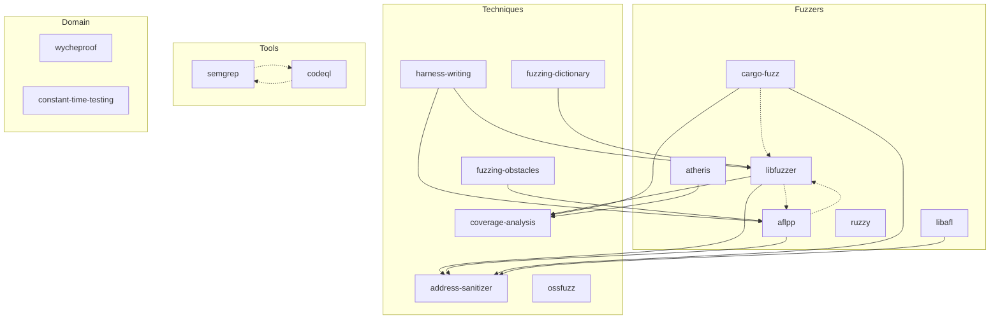

Meta-skill that generates Claude Code skills from the [Trail of Bits Application Security Testing Handbook](https://appsec.guide), providing expert guidance on security testing tools and techniques.

## Overview

This plugin contains a skill generator that analyzes the Testing Handbook structure and produces individual skills for security testing tools, fuzzing techniques, and testing methodologies. Each generated skill provides:

- **Tool-specific guidance** - Setup, configuration, and best practices
- **Language-specific patterns** - Tailored for C/C++, Rust, Python, Go, etc.
- **Practical examples** - Real-world usage patterns from security audits
- **Integration patterns** - CI/CD integration and workflow automation

<Info>
The plugin includes both the meta-skill generator AND 16 pre-generated skills covering fuzzers, static analysis tools, and testing techniques.
</Info>

## Generated Skills

### Fuzzers (6)

<CardGroup cols={2}>
  <Card title="libFuzzer" icon="bug" href="/plugins/testing-handbook-skills/libfuzzer">
    Coverage-guided fuzzing for C/C++ with LLVM integration
  </Card>
  <Card title="AFL++" icon="bug-slash" href="/plugins/testing-handbook-skills/aflpp">
    Multi-core fuzzing with advanced instrumentation
  </Card>
  <Card title="libAFL" icon="layer-group" href="/plugins/testing-handbook-skills/libafl">
    Modular fuzzing framework in Rust
  </Card>
  <Card title="cargo-fuzz" icon="rust" href="/plugins/testing-handbook-skills/cargo-fuzz">
    Rust-native fuzzing with libFuzzer backend
  </Card>
  <Card title="Atheris" icon="python" href="/plugins/testing-handbook-skills/atheris">
    Coverage-guided fuzzing for Python code
  </Card>
  <Card title="Ruzzy" icon="gem" href="/plugins/testing-handbook-skills/ruzzy">
    Fuzzing for Ruby applications
  </Card>
</CardGroup>

### Techniques (6)

<CardGroup cols={2}>
  <Card title="Harness Writing" icon="pen" href="/plugins/testing-handbook-skills/harness-writing">
    Patterns for effective fuzz target construction
  </Card>
  <Card title="Address Sanitizer" icon="shield-virus" href="/plugins/testing-handbook-skills/address-sanitizer">
    Memory error detection during testing
  </Card>
  <Card title="Coverage Analysis" icon="chart-line" href="/plugins/testing-handbook-skills/coverage-analysis">
    Measuring and improving test coverage
  </Card>
  <Card title="Fuzzing Dictionary" icon="book" href="/plugins/testing-handbook-skills/fuzzing-dictionary">
    Custom dictionaries for protocol fuzzing
  </Card>
  <Card title="Fuzzing Obstacles" icon="triangle-exclamation" href="/plugins/testing-handbook-skills/fuzzing-obstacles">
    Overcoming checksums, magic bytes, and complex parsers
  </Card>
  <Card title="OSS-Fuzz" icon="globe" href="/plugins/testing-handbook-skills/ossfuzz">
    Continuous fuzzing for open-source projects
  </Card>
</CardGroup>

### Static Analysis (2)

<CardGroup cols={2}>
  <Card title="Semgrep" icon="magnifying-glass" href="/plugins/testing-handbook-skills/semgrep">
    Fast pattern-based static analysis
  </Card>
  <Card title="CodeQL" icon="database" href="/plugins/testing-handbook-skills/codeql">
    Query-based semantic code analysis
  </Card>
</CardGroup>

### Domain-Specific (2)

<CardGroup cols={2}>
  <Card title="Wycheproof" icon="key" href="/plugins/testing-handbook-skills/wycheproof">
    Cryptographic library testing suite
  </Card>
  <Card title="Constant-Time Testing" icon="clock" href="/plugins/testing-handbook-skills/constant-time-testing">
    Timing side-channel verification
  </Card>
</CardGroup>

## Skill Cross-Reference

Generated skills reference each other based on natural relationships:



**Legend:**
- Solid arrows: Primary dependencies (techniques/tools used together)
- Dashed arrows: Alternatives (similar tools/fuzzers)

## Generator Usage

### Full Handbook Generation

Generate skills from all applicable handbook sections:

```bash
# Claude will:
# 1. Locate the handbook (or clone from GitHub)
# 2. Analyze handbook structure
# 3. Present generation plan
# 4. Generate skills on approval
# 5. Validate output
# 6. Update documentation
```

**Workflow:**
1. Locate handbook (check common locations, ask user, or clone)
2. Read `discovery.md` methodology
3. Scan handbook at `{handbook_path}/content/docs/`
4. Build candidate list with types (Tool/Fuzzer/Technique/Domain)
5. Present plan to user
6. On approval, generate each skill using appropriate template
7. Validate generated skills with `validate-skills.py`
8. Update main README with skills table
9. Update cross-reference graph

### Single Section Generation

Generate a skill from a specific handbook section:

```
"Create a skill for the libFuzzer section of the testing handbook"
```

The generator will:
1. Read `/testing-handbook/content/docs/fuzzing/c-cpp/10-libfuzzer/`
2. Identify type: Fuzzer Skill
3. Apply fuzzer template
4. Extract content and examples
5. Write to `skills/libfuzzer/SKILL.md`
6. Validate and report

### Regeneration

To update an existing skill after handbook changes:

```
"Regenerate the libfuzzer skill from the latest handbook content"
```

## Skill Types and Templates

The generator uses four skill templates:

| Type | Template | Example Sources | Key Sections |
|------|----------|-----------------|---------------|
| **Tool** | `tool-skill.md` | Semgrep, CodeQL | Installation, Configuration, Patterns, CI Integration |
| **Fuzzer** | `fuzzer-skill.md` | libFuzzer, AFL++ | Setup, Harness, Corpus, Options, Sanitizers |
| **Technique** | `technique-skill.md` | Harness writing, Coverage | Methodology, Patterns, Best Practices, Examples |
| **Domain** | `domain-skill.md` | Wycheproof, Constant-time | Domain Context, Tools, Test Suites, Validation |

## Quality Validation

Generated skills are validated with `scripts/validate-skills.py`:

```bash
# Validate all skills
uv run scripts/validate-skills.py

# Validate specific skill
uv run scripts/validate-skills.py --skill libfuzzer

# JSON output for CI
uv run scripts/validate-skills.py --json
```

**Validation checks:**
- Valid YAML frontmatter with name and description
- Required sections present (When to Use, When NOT to Use)
- Line count under 500 (split into references/ if needed)
- Cross-references to existing skills only
- No broken internal links

## Generator Architecture

### Two-Pass Generation

Solves forward reference problem (skills referencing skills that don't exist yet):

**Pass 1: Content Generation (Parallel)**
- Generate all skills simultaneously
- Skip "Related Skills" section
- Write content to `skills/{skill-name}/SKILL.md`

**Pass 2: Cross-Reference Population (Sequential)**
- Read all generated skill names
- Determine related skills based on handbook structure
- Update each SKILL.md with Related Skills section
- Validate all cross-references exist

### Agent Prompt Template

See `skills/testing-handbook-generator/agent-prompt.md` for full template with:
- Variable substitution (skill name, type, handbook path, pass number)
- Pre-write validation checklist
- Hugo shortcode conversion to Mintlify components
- Line count splitting rules
- Output report format

## Handbook Location

The generator automatically:
1. Checks common locations: `./testing-handbook`, `../testing-handbook`, `~/testing-handbook`
2. Asks user for path if not found
3. Clones from GitHub as last resort: `https://github.com/trailofbits/testing-handbook`

**No hardcoded paths** - adapts to your environment.

## Example Generated Content

Each generated skill includes:

- **Frontmatter** - Name, description for skill activation
- **When to Use** - Concrete triggers and use cases
- **When NOT to Use** - Antipatterns and wrong scenarios
- **Quick Start** - Installation and basic usage
- **Configuration** - Tool-specific setup and options
- **Examples** - Real-world patterns from security testing
- **CI Integration** - GitHub Actions/GitLab CI examples
- **Troubleshooting** - Common issues and solutions
- **Related Skills** - Cross-references to complementary skills
- **Resources** - External documentation (WebFetch summaries, no video content)

## Self-Improvement

After each generation run, the generator captures improvements:

**Improvement categories:**
- Template enhancements (missing sections, better structure)
- Discovery logic updates (pattern detection, false positives)
- Content extraction fixes (shortcode handling, formatting)

**Update process:**
1. Note issues during generation
2. Identify patterns that caused problems
3. Update relevant files:
   - `SKILL.md` - Workflow and decision tree
   - `templates/*.md` - Template improvements
   - `discovery.md` - Detection logic
   - `testing.md` - Validation checks

## Integration with Other Plugins

- **Property-Based Testing** - Combine fuzzing with property tests
- **Constant-Time Analysis** - Use with constant-time testing skill
- **Zeroize Audit** - Memory safety testing patterns
- **Spec-to-Code Compliance** - Verify test coverage against spec

## Resources

<CardGroup cols={2}>
  <Card title="Testing Handbook" icon="book" href="https://appsec.guide">
    Source material for all generated skills
  </Card>
  
  <Card title="Skill Templates" icon="template">
    Located in `skills/testing-handbook-generator/templates/`
  </Card>
  
  <Card title="Discovery Methodology" icon="map">
    See `skills/testing-handbook-generator/discovery.md`
  </Card>
  
  <Card title="Validation Testing" icon="vial">
    See `skills/testing-handbook-generator/testing.md`
  </Card>
</CardGroup>

<Note>
**Author:** Paweł Płatek (Trail of Bits)

**Version:** 1.0.1

**Generated Skills:** 16 (6 fuzzers, 6 techniques, 2 tools, 2 domain-specific)
</Note>